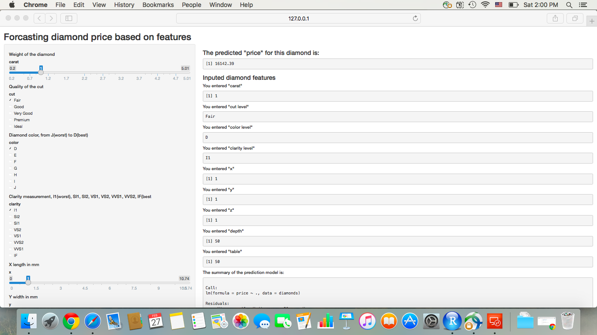

---
title       : MyShinyApp
subtitle    : Predicting diamond price based on features
author      : Gabegao
job         : Engineer
framework   : shower      # {io2012, html5slides, shower, dzslides, ...}
highlighter : highlight.js  # {highlight.js, prettify, highlight}
hitheme     : tomorrow      # 
widgets     : [mathjax]            # {mathjax, quiz, bootstrap}
mode        : selfcontained # {standalone, draft}
knit        : slidify::knit2slides

--- .class #id

## MyShinyApp - Predicting diamond price

1. The purpose of this app is to predict the price of diamond based on 9 selected features.
2. The prediction model is derived based on "diamonds" data, which contains 53940 observations of 10 variables (including actual price).
3. User could select the value for each of the 9 variables, and the price of the customized "diamond" will be predicted.

--- .class #id

## Selected Diamond Features

- carat: weight of the diamond 
- cut: quality of the cut (Fair, Good, Very Good, Premium, Ideal)
- color: diamond colour, from J(worst) to D(best)
- clarity: a measurement of how clear the diamond is 
 (I1(worst), SI1, SI2, VS1, VS2, VVS1, VVS2, IF(best))

Each variable has either checkbox or slidebar input.

--- .class #id

## Selected Diamond Features Cont.

- x: length in mm
- y: width in mm
- z: depth in mm
- depth: total depth percentage
- table: width of top of diamond relative to widest point

The app will start with default inputs.

--- #myslide

## Prediction Model for Diamond Price
1. This model is derived based on "diamonds" dataset, contained in ggplot2 package.
2. The factor variables: cut, color and clarity are all converted to numerical values.

```r
library(ggplot2)
data(diamonds)
diamonds$cut <- unclass(diamonds$cut)
diamonds$color <- unclass(diamonds$color)
diamonds$clarity <- unclass(diamonds$clarity)
fit<- lm(price ~ ., data=diamonds)
```

<style>#myslide li{font-size: 80%}</style>

--- .class #id

## Screenshot of MyshinyApp
<div id="bg">
  
</div> 
